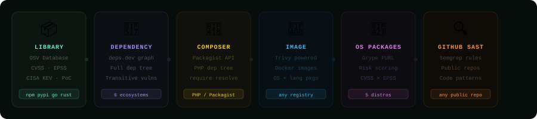
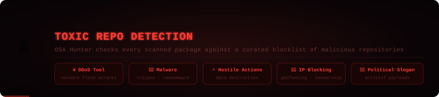
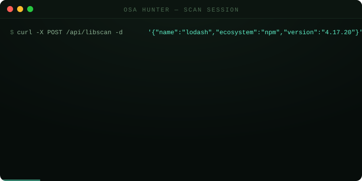

<div align="center">


<br/>

[](https://nodejs.org)
[](https://postgresql.org)
[](https://docs.docker.com/compose)
[](https://trivy.dev)
[](https://semgrep.dev)
[](#license)

**Self-hosted vulnerability scanner for your entire stack.**  
Library CVEs · Dependency trees · Docker images · OS packages · GitHub SAST — one dark dashboard, no SaaS.

</div>

---



<br/>

| | Scanner | What it checks |
|---|---|---|
| 📦 | **Library Scan** | Single package CVEs — OSV + CVSS + EPSS + CISA KEV + PoC |
| 🔗 | **Dependency Scan** | Full transitive dependency tree via deps.dev |
| 🐘 | **Composer Scan** | PHP require tree via Packagist |
| 🐋 | **Image Scan** | Docker image OS + language packages via Trivy |
| 🐧 | **OS Package Scan** | Single package on Ubuntu / Debian / RHEL / Alpine / SUSE |
| 🔍 | **GitHub SAST** | Public repo static analysis via Semgrep |


---

## ☠ Toxic Repo Detection



Every scanned package is checked against a curated blocklist of repositories known to contain malicious or harmful code. If a dependency traces back to one of these repos — you'll know before it reaches production.

| Category | Description |
|---|---|
| 💀 DDoS Tool | Packages designed to flood networks or amplify attacks |
| 🦠 Malware | Trojans, ransomware, or data-stealing payloads |
| ⚡ Hostile Actions | Code that destroys data or sabotages systems |
| 🚫 IP Blocking | Geofencing or censorship embedded in a library |
| 📢 Political Slogan | Activist payloads that hijack package behavior |

---

## Quick Start

```bash
git clone https://github.com/yourname/osa-hunter.git
cd osa-hunter
cp .env.example .env   # add NVD_API_KEY + SESSION_SECRET
docker compose up --build
```

Open **http://localhost:3000**. Set `ADMIN_PASSWORD` before the first start.

> Configure the initial administrator password before exposing the instance.

---



---

## API

All endpoints require a session cookie or `X-Api-Key` header.

```bash
# Library
curl -X POST /api/libscan -H "X-Api-Key: osa_xxxx" \
  -d '{"name":"lodash","ecosystem":"npm","version":"4.17.20"}'

# Docker image
curl -X POST /api/trivy/scan -d '{"image":"nginx","tag":"latest"}'

# GitHub repo
curl -X POST /api/ghscan -d '{"url":"https://github.com/owner/repo"}'
```

Full endpoint list: `libscan` · `depscan` · `composer` · `osscan` · `trivy/scan` · `ghscan` · `scans/history` · `export/pdf`

### Prometheus and logs

Metrics are published on a separate port bound to localhost only, not on the
public API port:

```bash
curl http://localhost:9100/metrics
```

The backend writes one JSON object per line to stdout. Each HTTP request includes
`timestamp`, `requestId`, `method`, `path`, `statusCode` and `durationMs` fields.
Sensitive authorization headers and cookies are never included in request logs.

`GET /api/ready` checks PostgreSQL connectivity and is used by the backend
container healthcheck. Long-running Trivy and Grype operations are limited by
`TRIVY_CONCURRENCY`/`GRYPE_CONCURRENCY` and their queue-size settings. External
HTTP calls use `HTTP_TIMEOUT_MS` and `HTTP_CONCURRENCY` as shared defaults.

`TRIVY_QUEUE_SIZE` and `GRYPE_QUEUE_SIZE` limit waiting scan requests. A full
queue returns HTTP `503`; the per-client rate limits return HTTP `429`. The
default limits are 5 Trivy requests/minute, 20 scan requests/minute, 120 API
requests/minute and 120 gateway requests/minute.

Scan and gate results are stored in PostgreSQL. A cache hit returns immediately
with `_cached: true`; a cache miss runs the scan and stores its result. The
`osa_cache_operations_total` metric tracks hits and misses by cache type.

For a Compose backup, dump PostgreSQL and archive the named volumes before
upgrades. For example:

```bash
docker compose exec -T postgres pg_dump -U "$PGUSER" "$PGDATABASE" > osa.sql
docker run --rm -v osa-hunter_nexus-data:/data -v "$PWD":/backup alpine \
  tar czf /backup/nexus-data.tgz -C /data .
```

## Package Proxy

OSA accepts package-manager metadata and archive requests, checks the package
name and version against OSV and `policy.yaml`, and streams allowed bytes from
the configured upstream. It does not install or execute packages. The open
gateway is read-only and only accepts known package paths and metadata paths.

The policy is evaluated after the package name and version are resolved.

## Gate Policy

The enforced policy lives in the database. On first boot `policy.yaml` is
imported, so an existing file-based setup keeps working and its rules appear in
the UI unchanged.

Manage it under **Rules** in the sidebar. Two kinds of rule share one list:

- **by name** — the package name is matched before anything is scanned, so it
  works in every ecosystem and never depends on a feed being reachable
  (`curl`, `npm/left-pad@1.3.0`, `crossenv*`);
- **by scan result** — conditions over the findings: severity counts, CISA KEV,
  EPSS, PoC, CVE ids.

Saving replaces the policy and takes effect immediately. There is no revision
history: keep the audited copy in git by pasting **Export YAML** into
`policy.yaml`. Every save bumps an internal counter that is part of the
verdict-cache key, so decisions cached under the previous policy are never
reused.

| Endpoint | Purpose |
|---|---|
| `GET /api/policy` | the policy the gate enforces |
| `GET /api/policy/yaml` | export it as `policy.yaml` |
| `PUT /api/policy` | replace it (`body` or `yaml`) |
| `POST /api/policy/normalize` | validate without storing |
| `GET /api/policy/facts` | the facts rules can match on |

All of these sit behind authentication; `/api/gate` stays the only open
endpoint. A policy is data, never code — rules are `{fact: expression}` pairs
interpreted by `lib/gate/policy.js`, and nothing in a policy is evaluated as JS.


## Nexus Gateway

OSA can run in front of Nexus and gate artifact requests before forwarding them:

```text
client -> OSA /nexus -> Nexus /repository -> upstream registry
```

Configure `NEXUS_UPSTREAM` and map repository names with
`OSA_NEXUS_REPOSITORIES`. Supported ecosystems are npm (JS/TS), PyPI
(Python), Packagist (PHP), Go, Maven (Java/Kotlin), NuGet (.NET), crates.io
(Rust), RubyGems (Ruby), Debian/Ubuntu, Alpine and RPM-based distributions.
Clients use `/api/gate/<repository>/...`:

```bash
npm config set registry http://localhost:3001/api/gate/npm-proxy
export GOPROXY=http://localhost:3001/api/gate/go-proxy
pip install --index-url http://localhost:3001/api/gate/pypi-proxy/simple package
export CARGO_REGISTRIES_CRATES_IO_INDEX=sparse+http://localhost:3001/api/gate/cargo-proxy/
```

Artifact requests are gated lazily; metadata requests are forwarded without
scanning every historical version. Unknown artifact paths are blocked while
`OSA_NEXUS_STRICT=true`. Cargo uses `index.crates.io` for metadata and
`static.crates.io` for archive downloads; configure `downloadUpstream` for that
repository when using direct mirrors.

Detailed documentation: [Russian](docs/package-gate.ru.md) · [English](docs/package-gate.en.md)

---

## Configuration

```env
NVD_API_KEY=your-key-here         # nvd.nist.gov/developers/request-an-api-key
SESSION_SECRET=long-random-string # change this
PGPASSWORD=strong-db-password     # change this
ADMIN_PASSWORD=strong-admin-password
SESSION_COOKIE_SECURE=false        # set true when served over HTTPS
HTTPS=false                       # set true when TLS terminates at the proxy
CVE_CACHE_TTL_HOURS=24             # refresh enrichment data after 24 hours
```

---

## Security

- Passwords hashed with **bcrypt** (12 rounds)
- API keys stored as **SHA-256 hashes** only
- Login rate-limited — 10 attempts/minute per IP
- `HttpOnly` + `SameSite=lax` cookies
- HTTPS-only `__Host-osa.sid` cookies when `SESSION_COOKIE_SECURE=true`
- `X-Frame-Options` · `CSP` · `Referrer-Policy` headers

---

<div align="center">

**[⭐ Star this repo](../../stargazers)** if OSA Hunter caught something in your stack

<sub>Built with ☕ and mild existential dread about open source dependencies</sub>

</div>
