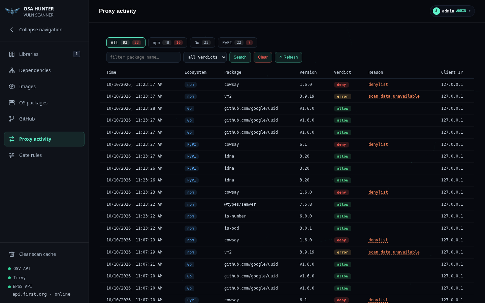
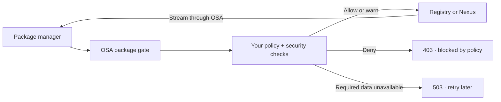
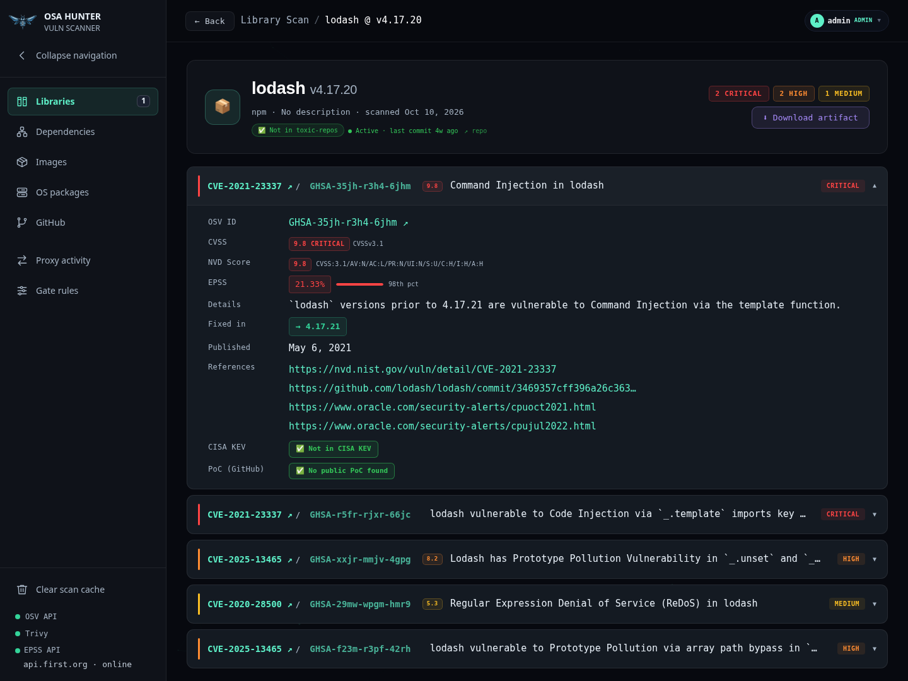

<div align="center">



[](https://github.com/ShinigamiKiko/osa-hunter/actions/workflows/test.yml)
[](https://nodejs.org)
[](https://postgresql.org)
[](https://docs.docker.com/compose)
[](LICENSE)

**Self-hosted package firewall and vulnerability scanner for your software supply chain.**

Check packages before they reach your builds. Investigate vulnerabilities in one dashboard.

[Quick start](#quick-start) · [How it works](#how-it-works) · [Scanners](#scan-your-stack) · [Production](#production) · [Documentation](#documentation)

</div>



<p align="center"><sub>Real dashboard from a local test instance: npm, PyPI and Go downloads, with the verdict and its reason beside each request.</sub></p>

## Why OSA Hunter?

OSA sits between your package managers and their upstream registries or Nexus. It checks requested artifacts against your policy, then streams allowed downloads to the client. The same instance gives your team a dashboard for scanning packages, dependency trees, container images, OS packages and public GitHub repositories.

- **Set your own rules.** Block package names or versions, vulnerability severities, known exploited CVEs, exploit probability, public PoCs or toxic repository matches.
- **See why a download was blocked.** Follow the decision from proxy activity to the matching rule in the UI.
- **Investigate the whole stack.** Inspect CVEs, dependency findings and SAST results; export reports as PDF.
- **Run on your infrastructure.** Docker Compose, PostgreSQL, browser sessions, API keys and Prometheus metrics. Security checks use external data sources.

## How it works

Point a package manager at `/api/gate/<repository>/...`. For an artifact request, OSA resolves the package and version before evaluating the active policy:


```mermaid
flowchart LR
    Client[Package manager] --> Gate[OSA package gate]
    Gate --> Policy[Your policy + security checks]
    Policy -->|Allow or warn| Upstream[Registry or Nexus]
    Upstream -->|Stream through OSA| Client
    Policy -->|Deny| Block[403 · blocked by policy]
    Policy -->|Required data unavailable| Retry[503 · retry later]
```

| Signal | What it tells you |
|---|---|
| **OSV / CVSS** | Known vulnerabilities and their severity |
| **CISA KEV** | Vulnerabilities known to be exploited |
| **EPSS** | Estimated probability of exploitation |
| **Public PoCs** | Available proof-of-concept exploit references |
| **Toxic repositories** | Matches against the configured repository/package feed |
| **Your rules** | Package-name patterns, versions, CVE IDs and combined conditions |

Metadata is forwarded without scanning every historical version. Allowed archives are streamed; the gateway does not install or execute packages. With `on_gate_error: deny`, an unavailable required security check returns **503** with `Retry-After`; a policy block returns **403**. Unavailable checks are never cached as a verdict. Enrichment sources are configurable; the default policy and your network access determine which checks run.

**Supported gateway ecosystems:** npm · PyPI · Go · Composer/Packagist · Maven · NuGet · Cargo/crates.io · RubyGems · Debian/Ubuntu · Alpine · RPM distributions.

See the package gate guide in [English](docs/package-gate.en.md) or [Русский](docs/package-gate.ru.md) for policy facts, artifact formats and upstream mappings.

## Quick start

For a local instance, install **Docker with Compose** and **Node.js 22+**, then run:

```bash
git clone https://github.com/ShinigamiKiko/osa-hunter.git
cd osa-hunter
node scripts/init-env.cjs --development
docker compose up --build
```

Open **http://localhost:3000** and sign in as **admin** with the unique `ADMIN_PASSWORD` from the generated `.env`. The helper preserves an existing `.env` and never prints credentials.

### Route package downloads through OSA

Configure your upstream repositories before pointing clients at the gate. Nexus is optional; each repository can use a direct registry or a Nexus upstream. For example, add these direct mappings to `.env`:

```env
OSA_NEXUS_REPOSITORIES={"npm-proxy":{"ecosystem":"npm","upstream":"https://registry.npmjs.org","direct":true},"pypi-proxy":{"ecosystem":"PyPI","upstream":"https://pypi.org","direct":true},"go-proxy":{"ecosystem":"Go","upstream":"https://proxy.golang.org","direct":true}}
```

Recreate the backend after changing `.env`: `docker compose up -d backend`. Test the local routes without changing your global package-manager configuration:

```bash
npm pack is-odd@3.0.1 --ignore-scripts \
  --registry=http://localhost:3000/api/gate/npm-proxy
python -m pip download --no-deps \
  --index-url http://localhost:3000/api/gate/pypi-proxy/simple \
  --trusted-host localhost idna==3.10
GOPROXY=http://localhost:3000/api/gate/go-proxy \
  go mod download github.com/google/uuid@v1.6.0
```

The HTTP examples above are for the local development instance. Use your HTTPS endpoint for production clients.

## Scan your stack



| Scanner | What it checks |
|---|---|
| 📦 **Library** | A package version against OSV, with CVSS, EPSS, CISA KEV and PoC enrichment |
| 🔗 **Dependencies** | Transitive dependencies and their vulnerabilities via deps.dev |
| 🐘 **Composer** | PHP dependency resolution through Packagist |
| 🐋 **Container image** | OS and language packages with Trivy; registry hosts are configurable |
| 🐧 **OS package** | Ubuntu, Debian, RHEL, Alpine and SUSE packages with Grype |
| 🔍 **GitHub SAST** | Static analysis of public repositories with Semgrep |



<p align="center"><sub>A real library scan: inspect individual findings, severity and available fixes from the same dashboard.</sub></p>

### Toxic repository detection



Check package identities and source repositories against a curated feed. Matches use the full repository identity or an explicit package URL/PURL; a shared basename alone does not identify a toxic repository. Feed categories include malware, DDoS tools, destructive behavior, embedded IP blocking and political payloads.

Enable the feed and use `toxic.found` in your policy to act on matches. See [identity matching and supported metadata lookups](docs/operations.md#toxic-repository-matching).

<details>
<summary><strong>See the scanner terminal illustration</strong></summary>



<sub>Illustration of the scan workflow; live results depend on the package, version and available security data.</sub>

</details>

## Production

Deploy behind an external **nginx or Ingress that terminates HTTPS**:

```bash
node scripts/init-env.cjs
docker compose -f docker-compose.yml -f docker-compose.production.yml up --build -d
```

Use this setup for a fresh production environment. If `.env` already exists, the helper preserves it; follow the guide to update credentials and migrate an existing instance. Production requires strong credentials and secure cookies. The frontend, backend and metrics listeners are published on localhost.

The [production deployment guide](deploy/production/README.md) includes the external nginx configuration, proxy headers, credential requirements, existing-database migration and backup guidance.

## Documentation

| Guide | Contents |
|---|---|
| [Package gate · English](docs/package-gate.en.md) / [Русский](docs/package-gate.ru.md) | Request flow, policy facts, supported formats and repository mappings |
| [Operations and API](docs/operations.md) | API examples, accounts, live policy editing, Nexus, metrics, queues, caches and backups |
| [Production deployment](deploy/production/README.md) | External HTTPS nginx/Ingress and production credentials |
| [Environment settings](.env.example) | Available environment variables and defaults |
| [Default policy](policy.yaml) | Policy imported into PostgreSQL on first boot |

The active policy lives in PostgreSQL and is managed under **Rules**. Export YAML to keep a reviewed copy in Git; changing the seed file does not replace an existing database policy.

## License

OSA Hunter is released under the [MIT License](LICENSE).

<div align="center">

**[⭐ Star OSA Hunter](https://github.com/ShinigamiKiko/osa-hunter/stargazers)** if it helps you keep track of your dependencies.

<sub>Built with ☕ and mild existential dread about open source dependencies.</sub>

</div>
